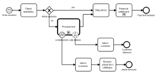

```{r setup, include=FALSE}
knitr::opts_chunk$set(echo = TRUE)
```



# bpmn

[](https://travis-ci.org/bergant/bpmn)

## Overview
bpmn is an R interface to the [bpmn-js](https://github.com/bpmn-io/bpmn-js) library (a BPMN 2.0 rendering toolkit and web modeler) from [bpmn.io](https://bpmn.io/). Using JavaScript in R is handled by [htmlwidgets](http://www.htmlwidgets.org/) framework. 

## Installation 
Install from GitHub:

```{r, eval=FALSE}
devtools::install_github("bergant/bpmn")
```


## Usage 

```{r}
library(bpmn)
```

`bpmn` widget accepts a BPMN file (or an XML document):

```{r eval=FALSE}
bpmn_file <- system.file("examples/qr-code.bpmn", package = "bpmn")
bpmn(bpmn_file)
```

See bpmn widget in action on https://bergant.github.io/bpmn/.

## Licenses

This package: MIT License

See [license file](inst/htmlwidgets/lib/bpmn-js/LICENSE) for 
the included **bpmn-js** library
